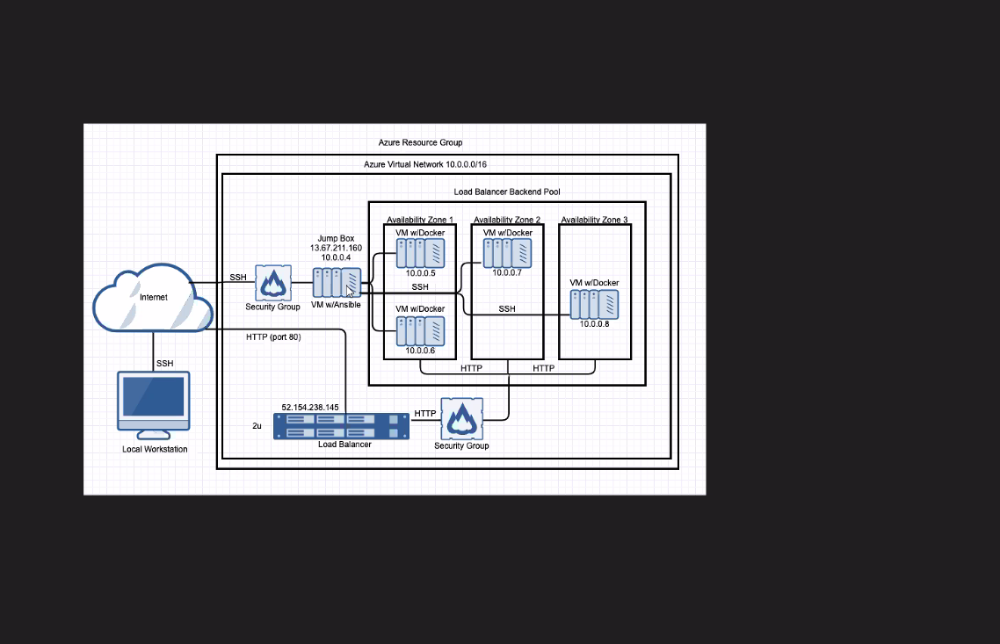

Automated Elastic Stack Deployment

The files in this repository were used to configure the network depicted below.

These files have been tested and used to generate a live ELK deployment on Azure. They can be used to either recreate the entire deployment pictured above. Alternatively, select portions of the ElkStack file may be used to install only certain pieces of it, such as Filebeat.

FileBeat-Config:.
This document contains the following details:

Description of the Topology
Access Policies
ELK Configuration
Beats in Use
Machines Being Monitored
How to Use the Ansible Build
Description of the Topology

The main purpose of this network is to expose a load-balanced and monitored instance of DVWA, the D*mn Vulnerable Web Application.

Load balancing ensures that the application will be highly efficient, in addition to restricting overloads to the network.

Load balancers defend organizations against DDos attacks by shifting attack traffic away from the corporate server towards a public cloud.   A jump box provides a buffer by being an origination point for admins running tasks.  Integrating an ELK server allows users to easily monitor the vulnerable VMs for changes to the logs and system traffic.

Filebeat watches and monitors log files for anomalies and sends data to pre determined location for review.
Metricbeat is installed on the server and monitors operating system changes.
The configuration details of each machine may be found below. Note: Use the Markdown Table Generator to add/remove values from the table.

| Name	  | Function	| IP Address	| Operating System
|-------- |:---------:| :----------:|-----------------:|
|Jump Box	| Gateway	  |  10.0.0.4	  |       Linux      |
|Web 1		| Virtual Machine | 10.0.0.7 | Linux | 
|Web 2		|	Virtual Machine | 10.0.0.8 | Linux |
|ElkStack	|	Virtual Machine | 10.1.0.4 | Linux |

Access Policies:

The machines on the internal network are not exposed to the public Internet.

Only the JumpBox machine can accept connections from the Internet. Access to this machine is only allowed from the following IP addresses: 136.35.21.76 and 140.82.173.162

Machines within the network can only be accessed by SSH.

TODO: Which machine did you allow to access your ELK VM? What was its IP address?
A summary of the access policies in place can be found in the table below.

| Name	| Publicly Accessible	 | Allowed IP Addresses
| ------| :------------------: | -------------------: |
| JumpBoxProvisioner	| Yes      |  52.168.5.47
|ElkStackVM | Yes     |     40.75.18.92

Ansible was used to automate configuration of the ELK machine. No configuration was performed manually, which is advantageous because...

It allows admins to automate monotonous tasks to free time for more important items.
The playbook implements the following tasks:

TODO: In 3-5 bullets, explain the steps of the ELK installation play. E.g., install Docker; download image; etc.
1.
2.
3.
4.
5.

The following screenshot displays the result of running docker ps after successfully configuring the ELK instance.

TODO: Update the path with the name of your screenshot of docker ps output

Target Machines & Beats

This ELK server is configured to monitor the following machines:

TODO: List the IP addresses of the machines you are monitoring
We have installed the following Beats on these machines:

TODO: Specify which Beats you successfully installed
These Beats allow us to collect the following information from each machine:

TODO: In 1-2 sentences, explain what kind of data each beat collects, and provide 1 example of what you expect to see. E.g., Winlogbeat collects Windows logs, which we use to track user logon events, etc.
Using the Playbook

In order to use the playbook, you will need to have an Ansible control node already configured. Assuming you have such a control node provisioned:

SSH into the control node and follow the steps below:

Copy the _____ file to _____.
Update the _____ file to include...
Run the playbook, and navigate to ____ to check that the installation worked as expected.
TODO: Answer the following questions to fill in the blanks:

Which file is the playbook? Where do you copy it?
Which file do you update to make Ansible run the playbook on a specific machine? How do I specify which machine to install the ELK server on versus which to install Filebeat on?
_Which URL do you navigate to in order to check that the ELK server is running?
As a Bonus, provide the specific commands the user will need to run to download the playbook, update the files, etc.
